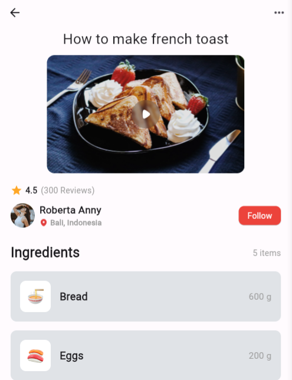
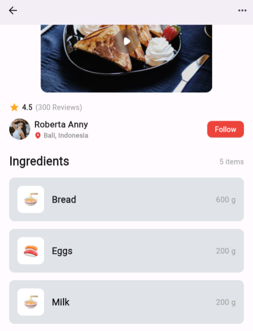

# FLUTTER PROJECT - FOOD RECIPE

## Project Description

- Based on the image provided in the README.md file, the project was broken down into different parts.

- The project contains a widget folder in the lib folder and includes all the broken down widgets used to bring the design together.

- The files contained in the widget folder are as follows:

    - Appbar.dart: This contains two icons, an arrow back icon and a more icon.

    - Hero.dart: This contains the Title of the page and a hero image with a play button on the image to display the hero section like a video.

    - Review.dart: Yhis contains the rating and review part of the design, a star icon, a rating value and a review count.

    - UserInfo.dart: This contains the user information such as a profile image, the users name and location icon with the location and finally a follow button.

    -Ingredients: This contains two classes, one to define  the container for a single ingredient which has an ingredient image, name and weight of the ingredient.
    The second class lists out the entire ingredient section which includes a header with a title and the number of items followed by a list of ingredients.

- All widgets were imported into the main.dart file and brought together to form the mobile app.

## Project Screenshot

